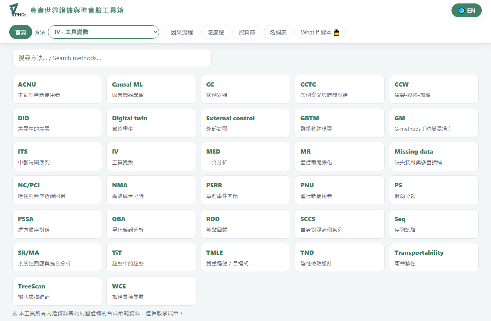

# 真實世界證據與準實驗工具箱 · RWE & Quasi-experimental Toolbox



> **In English —** A bilingual (Traditional Chinese / English), browser-based teaching and
> analysis toolbox for **causal inference and real-world evidence (RWE)**. It covers **32
> observational and quasi-experimental study designs**, each unpacked into the same six
> learning layers (①–⑥): what it is, an interactive demo, **runnable SAS · R · Stata code on a
> downloadable per-method sample CSV**, a traffic-light assumptions check, an "add machine
> learning" layer, and a "what if the assumptions break" layer. Plus a home gallery, a
> **method-picker decision tree**, a databases page, a glossary, and password-gated bilingual
> study notes on Hernán & Robins' *Causal Inference: What If*. The same Python compute core
> (`backend/*.py`) runs under FastAPI locally and in-browser via Pyodide, so the site can be
> served fully static from GitHub Pages. **Live:** <https://danielhttsai.github.io/phdc-rwe-tool/>

一個可在瀏覽器直接使用的**因果推論 / 真實世界證據（RWE）教學與分析工具箱**：把 32 種
觀察性研究與準實驗設計，每一種都拆成白話、可互動的六個學習層次，並附上可直接執行的
SAS · R · Stata 程式與可下載的示範資料。全站**中英雙語**即時切換。

- 線上版（GitHub Pages，免安裝）：<https://danielhttsai.github.io/phdc-rwe-tool/>
- 架構：**Python 計算核心（`backend/*.py`）**，本機用 FastAPI 跑，靜態版則用
  [Pyodide](https://pyodide.org) 在瀏覽器裡跑「同一份 Python」，前端一行都不用改寫。

> 這個專案由早期的「工具變數（IV）教學工具」演化而來；IV 如今只是其中一種方法。

---

## 這個工具箱有什麼

### 32 種方法，每種都有 ①–⑥ 六個層次

每個方法都用同一套六分頁的教學結構：

| 分頁 | 內容 |
|---|---|
| **① 是什麼** | 用生活化的故事＋名詞解釋白話講清楚這個方法在做什麼、假設是什麼。 |
| **② 互動講解** | 可拉滑桿的即時模擬圖，親手看參數怎麼牽動估計與偏誤。 |
| **③ 資料分析** | 完整、可直接跑的 **SAS · R · Stata** 三語程式，每種方法配一份可下載的 `data/<method>_sample.csv`，用真實欄位名，貼上就能跑。 |
| **④ 假設檢驗** | 對資料自動做紅／黃／綠燈的假設體檢＋白話結論（可辨識性、正性、平衡、可交換性等）。 |
| **⑤ 用 AI 強化** | 這個方法能怎麼搭配機器學習（彈性 nuisance 模型、雙重穩健、CATE…），以及 ML 幫不上忙的地方。 |
| **⑥ 如果……？** | 反事實 / 敏感度思考：假設被打破會怎樣、如何用設計或分析補救。 |

部分方法另附**自我測驗（self-check quiz）**小卡。

方法清單（下拉選單，依英文名）：

| 縮寫 | 方法 |
|---|---|
| IV | Instrumental variables 工具變數 |
| MR | Mendelian randomization 孟德爾隨機化 |
| RDD | Regression discontinuity 斷點回歸 |
| DiD | Difference-in-differences 差異中的差異 |
| ITS | Interrupted time series 中斷時間序列 |
| TiT | Trend-in-trend 趨勢中的趨勢 |
| PS | Propensity score 傾向分數 |
| TMLE | Doubly-robust / targeted ML 雙重穩健／目標最小損失 |
| GM | G-methods（時變混淆） |
| CCW | Clone-censor-weight 複製-設限-加權 |
| Seq | Sequential target trials 序列目標試驗 |
| PNU | Prevalent new-user 盛行新使用者 |
| ACNU | Active-comparator new-user 主動對照新使用者 |
| SCCS | Self-controlled case series 自身對照病例系列（含 SCRI） |
| CCTC | Case-crossover & time-control 病例交叉 |
| PSSA | Prescription sequence symmetry 處方順序對稱 |
| WCE | Weighted cumulative exposure 加權累積暴露 |
| CC | Case-control 病例對照 |
| TND | Test-negative design 陰性檢驗設計 |
| NC/PCI | Negative control & proximal causal inference 陰性對照與近端因果 |
| PERR | Prior event rate ratio 事前事件率比 |
| TreeScan | Tree-based scan statistic 樹狀掃描統計 |
| SR/MA | Systematic review & meta-analysis 系統性回顧與統合分析 |
| NMA | Network meta-analysis 網絡統合分析 |
| GBTM | Group-based trajectory model 群組軌跡模型 |
| MED | Mediation analysis 中介分析 |
| Causal ML | CATE & meta-learners 因果機器學習 |
| Digital twin | 數位分身 |
| External control | 外部對照臂 |
| Transportability | 可移轉性 |
| Missing data | 缺失資料與多重插補 |
| QBA | Quantitative bias analysis（含 E-value 量化偏誤分析） |

### 方法以外的頁面

- **首頁 Home** — 工具箱總覽與方法卡入口。
- **怎麼選 Which one?** — 互動式**決策樹**，依你的資料與問題導向合適的方法。
- **資料庫 Databases** — 常見真實世界資料庫的整理。
- **名詞表 Glossary** — 集中式術語表。
- **What If（課本）** — Hernán & Robins《Causal Inference: What If》全 23 章的**雙語逐段讀書筆記**，
  加密、需密碼開啟（教學用摘要，非書本原文）。

### 全站特性

- **中英雙語**：每個元素同時帶中文 innerHTML 與英文 `data-en`，一鍵切換（存 `localStorage`）。
- **可分享的深連結**：網址 hash 記住目前方法與分頁（`#m=sccs&t=analyze`），重整不跑掉。
- **③ 的程式可真的跑**：三語程式都讀各自的 `data/<method>_sample.csv`（36 份合成 CSV），欄位一致、貼上即跑。
- 圖表用 Plotly（延後載入以加速首屏），並附 ARIA 標籤與 `:focus-visible` 等無障礙處理。

---

## 安裝與啟動（本機 FastAPI 開發版）

需求：Python 3.10+（已在 3.14 測試）。

```powershell
cd "D:\Drive\IV detection\webtool"
python -m pip install -r requirements.txt

cd backend                      # app.py 用扁平 import，需在 backend\ 內啟動
python gen_data.py              # 產生內建 IV 範例（首次；其餘方法的資料由 tools\make_samples.py 產）
python -m uvicorn app:app --port 8000
```

開啟瀏覽器：<http://127.0.0.1:8000>

---

## 純靜態版（瀏覽器直跑，可放 GitHub Pages）

不想開伺服器、想給別人一個網址點開就能用，可以打包成**完全在瀏覽器跑**的靜態網站：
計算改用 Pyodide（在瀏覽器裡跑 Python 的 WASM 版），重用同一份 `backend/*.py`，不需要任何後端。

```powershell
cd "D:\Drive\IV detection\webtool"
python tools\make_samples.py    # 產生 frontend\data\*.csv（36 份方法示範資料）
python build_docs.py            # 組裝出 docs\（GitHub Pages 來源）
```

- `web/api.py`：把後端端點改寫成可被瀏覽器呼叫的 `route()`。
- `web/pyodide-bridge.js` · `web/pyodide-worker.js`：載入 Pyodide + numpy/scipy/pandas/sklearn，
  攔截 `/api/*` 的 `fetch` 改走 Pyodide，讓前端 `app.js` 一行都不用改。
- `build_docs.py`：把 `frontend/*`、`backend/*.py` 與 `frontend/data/*` 組裝進 `docs/`
  （產生物；改來源後重跑即可）。

**部署**：GitHub 設定 → Pages → Source 選 `main` 分支的 `/docs`。首次開啟需下載運算核心
（約 20–40 MB，之後瀏覽器會快取）。

**本機預覽靜態版**：`cd docs; python -m http.server 8001` → <http://127.0.0.1:8001>
（建置前請先關掉任何開著 `docs/` 的預覽伺服器，否則會鎖檔。）

> 注意：私有 repo 的 GitHub Pages 需付費方案；免費帳號需 repo 設為公開才能發佈。

---

## 內建與示範資料（全部為純屬虛構的合成資料）

所有資料都是**為教學自行設計的合成情境**，欄位、數字、結構都是自訂的，請勿當成真實資料使用。

- `backend/data/demo_vaccine.csv`：IV 的「隨機接種提醒」情境
  （工具 Z＝`vaccine_reminder`、處置 A＝`vaccinated`、結果 Y＝`health_score_change`，
  真值 LATE ≈ 1.80）。
- `frontend/data/<method>_sample.csv`：其餘每種方法一份、共 36 份，由 `tools/make_samples.py`
  以固定亂數種子與寫明的欄位結構產生，讓 ③ 的三語程式能直接跑出合理輸出。

上傳自己的資料：CSV 須為數值欄位；在 ③ 分頁選欄位對應即可。

---

## 程式結構

```
webtool/
├─ frontend/            # 來源：前端
│  ├─ index.html        #   全部頁面與 ①–⑥ 面板
│  ├─ app.js            #   路由、圖表、互動、加密的 What If 讀書筆記、測驗
│  ├─ i18n.js           #   中英雙語切換
│  ├─ styles.css
│  └─ data/*.csv        #   36 份方法示範資料
├─ backend/             # 來源：Python 計算核心（本機 FastAPI + 靜態版共用）
│  ├─ app.py            #   FastAPI：API + 靜態前端
│  ├─ <method>_core.py / _gen.py / _assumptions.py / _ml.py   # 各方法的計算、產資料、假設、ML
│  ├─ iv_core.py · assumptions.py · ml_iv.py · gen_data.py    # IV（歷史核心）
│  └─ test_*.py         #   31 組 pytest（鎖定教材數字與結構）
├─ web/                 # 靜態版橋接：api.py + Pyodide bridge/worker
├─ tools/make_samples.py# 產生 frontend/data 的 36 份 CSV
├─ tests/smoke.spec.js  # Playwright 冒煙測試（載入頁面、逐方法檢查無 console error）
├─ build_docs.py        # 來源 → docs/（GitHub Pages 產生物）
├─ docs/                # 建置產生物（Pages 來源，勿手改）
└─ .github/workflows/ci.yml   # CI：pytest + 建置檢查 + 結構測試 + Playwright
```

統計（OLS、2SLS、F、McFadden R²、風險比、存活曲線等）多以 numpy/scipy 自行實作以求可攜；
需要時才用 scikit-learn（如 ⑤ 的隨機森林示範）、statsmodels。

---

## 測試

```powershell
cd "D:\Drive\IV detection\webtool\backend"
python -m pytest -q                             # 後端數字與結構（含 test_frontend_structure.py）

cd "D:\Drive\IV detection\webtool"
npx playwright install --with-deps chromium     # 首次
npm run test:e2e                                # 前端冒煙測試
```

`backend/test_frontend_structure.py` 是純 Python 的結構守門：檢查每個方法的六個子面板、
下拉選項、以及每份 `data/<method>_sample.csv` 存在且欄位涵蓋 R 程式用到的欄位。

CI（`.github/workflows/ci.yml`）在每次 push 跑：`pytest` → `build_docs.py` 建置檢查 →
結構測試 → Playwright 冒煙測試。

---

## 主要參考文獻

方法與假設框架整理自各方法領域的原始文獻（每個方法的 ① 與參考文獻頁均列出對應出處），
包含但不限於：

- Hernán MA, Robins JM. *Causal Inference: What If.* Chapman & Hall/CRC, 2020（2025 更新）。
  免費全文：<https://miguelhernan.org/whatifbook>（⑥ What If 讀書筆記所本）。
- Farrington CP (1995); Whitaker HJ, Farrington CP, Musonda P (2006) — SCCS 方法。
- Homayra F, et al. (2024). *Epidemiology* 35(2):218–231 — IV 的 A1–A4b 假設檢驗框架。
- 以及各方法在 ③ 程式卡「出處 / Sources」列出的套件文件與方法論文。

（完整清單見站內各方法的參考文獻，以及 `SELF_AUDIT.md`。）
